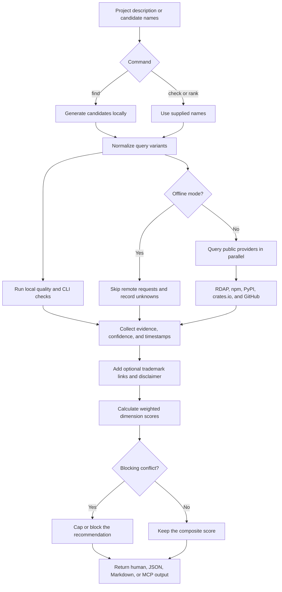

# NameScope

Picking a project name is easy. Finding out whether that name is usable across package registries, GitHub, domains, and the command line is the tedious part.

NameScope does that research from your terminal. Give it a project description or a shortlist of names and it returns a scored report with the evidence behind every result. Generation and scoring run locally; network checks use public provider endpoints.

NameScope is built for software projects. It cannot promise that a business name, domain, social handle, or trademark is legally available.

## Quick start

NameScope requires Node.js 24 LTS or newer. You can run it without installing anything globally:

```bash
npx namescope find "a fast open-source database migration tool"
npx namescope check taskforge
npx namescope rank taskforge taskmint orbitdesk
```

No account, subscription, payment, hosted backend, Docker setup, or language model is required. A `GITHUB_TOKEN` is optional and only increases GitHub API rate limits.

## How it works

`find` starts with a project description and generates deterministic candidates. `check` starts with one name, while `rank` compares several. All three eventually use the same checking and scoring engine.



Provider-specific commands such as `domains` and `packages` return their evidence directly instead of building a complete composite report.

### 1. Generate or accept candidates

Name generation is local and reproducible. NameScope combines useful words from the description with related terms, compounds, prefixes, suffixes, and blends. Generated names are only ideas; they do not carry availability claims until checks run.

### 2. Check public and local namespaces

NameScope checks each candidate against the sources relevant to software projects:

| Area | What is checked | Important limitation |
| --- | --- | --- |
| Packages | npm name validity, then exact and separator variants on npm, PyPI, and crates.io | Registry state can change immediately |
| GitHub | Repository-name search and exact user or organization namespace | Search is not proof of global availability |
| Domains | Selected TLDs through public RDAP | A 404 is a useful signal, not a purchase guarantee |
| CLI | Local `PATH`, common commands, language tools, and shell-reserved names | Results describe the current machine |
| Name quality | Length, word count, pronunciation proxy, punctuation, numbers, ambiguity, and relevance | These are heuristics, not user research |
| Trademark | Official manual-search links and a legal disclaimer when requested | This is not trademark clearance or legal advice |

Search distinctiveness stays neutral until a search adapter exists. Social handles are not checked in version 0.1.

### 3. Keep uncertainty visible

A timeout, rate limit, blocked request, unsupported provider, or malformed response remains `unknown`, `unsupported`, or `error`. NameScope never turns a failed lookup into “available.”

Every completed report includes provider evidence, confidence, timestamps, warnings, unknown checks, dimension scores, weights, and a plain-language explanation.

### 4. Score and rank

The default score combines package uniqueness, GitHub uniqueness, domain options, deterministic name quality, search distinctiveness, and CLI usability. Weights are configurable and normalized by their actual sum, so they do not need to total 100.

A package collision or another confirmed blocking conflict can cap or block a recommendation. A high score still means “strong candidate based on these checks,” not “safe everywhere.”

## Commands

| Command | Use it to |
| --- | --- |
| `namescope find <description>` | Generate, check, and rank project-name ideas |
| `namescope check <name>` | Build a complete report for one name |
| `namescope rank <name...>` | Compare two or more existing candidates |
| `namescope domains <name>` | Check selected domain extensions only |
| `namescope packages <name>` | Check selected package registries only |
| `namescope mcp` | Start the local MCP stdio server |

Useful examples:

```bash
# Check selected domains
npx namescope domains taskforge --tlds com,io,dev,app

# Check selected package registries
npx namescope packages taskforge --registries npm,pypi,crates

# Return structured output
npx namescope check taskforge --json

# Prevent every network request
npx namescope check taskforge --offline

# Include preliminary trademark resources
npx namescope check taskforge --include-trademark --nice-classes 9,42
```

Output formats are human-readable text, `--json`, `--compact-json`, and `--markdown`.

## Privacy and offline use

Generation, normalization, quality analysis, scoring, cache handling, and CLI collision checks run locally. Remote commands send only the requested candidate and query variant to the selected providers.

Use `--offline` to prevent all network requests. NameScope has no telemetry and does not collect project names or descriptions. Read the [privacy documentation](docs/privacy.md) for provider-by-provider details.

## Configuration

Copy [`namecheck.config.example.json`](namecheck.config.example.json) to `namecheck.config.json`. Use it to change TLDs, registries, scoring weights, timeouts, cache lifetime, concurrency, or excluded words. CLI flags override file values.

See the [configuration guide](docs/configuration.md) and [scoring methodology](docs/methodology.md).

## MCP setup

NameScope exposes the same engine through a local MCP stdio server:

```json
{
  "mcpServers": {
    "namescope": {
      "command": "npx",
      "args": ["-y", "namescope", "mcp"]
    }
  }
}
```

Available tools are `generate_names`, `check_name`, `rank_names`, `check_domains`, `check_packages`, `check_github`, `check_trademark`, and `explain_score`. Read the [MCP guide](docs/mcp.md) for details.

## Development

```bash
git clone https://github.com/ensp1re/namescope.git
cd namescope
npm install
npm run check
npm run build
node packages/cli/dist/index.js find "an open-source TypeScript job queue" --offline
```

The repository is an npm workspace split into schemas, core logic, provider adapters, MCP, and CLI packages. Read the [architecture guide](docs/architecture.md) for the dependency flow and [`CONTRIBUTING.md`](CONTRIBUTING.md) before sending a change.

## Know the limits

Results are snapshots, and public namespaces can change at any time. RDAP behavior varies between registries, GitHub search is not exhaustive, local command checks vary by machine, and deterministic quality scores cannot replace research with real people.

Trademark output is preliminary information, not legal advice or a comprehensive clearance search. Consult a qualified trademark attorney before relying on a name commercially. The full list lives in [limitations](docs/limitations.md).

## License

[MIT](LICENSE)
